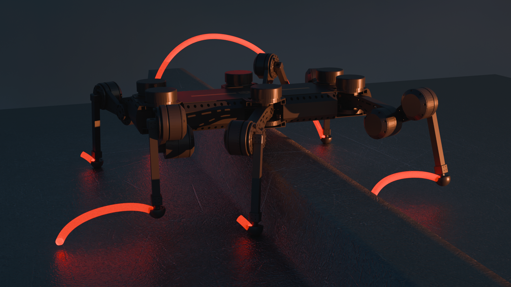
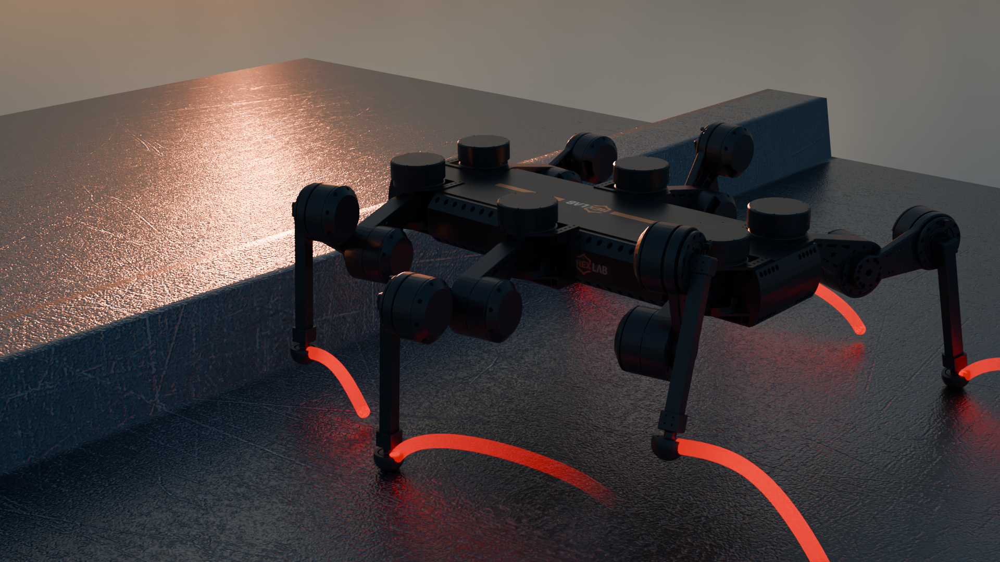

<div style="display:flex; justify-content:center;">
    
    
</div>

# Blender Utilities

Blender Utilities for modeling, animation, and rendering.

## pkg blender_utils

### Installation

```bash
pip install -e ./
```

## [urdf_importer](https://github.com/HoangGiang93/urdf_importer)

### Installation

Linux:

```bash
cd <blender_path>/<version>/python/bin/ # For example cd blender-3.1.2-linux-x64/3.1/python/bin/
./python3.10 -m ensurepip
./python3.10 -m pip install --upgrade pip
./python3.10 -m pip install pyyaml
./python3.10 -m pip install rospkg
./python3.10 -m pip install urdf_parser_py
```

Windows:

Note:

- If Blender is installed to i.e. C:\Program Files\, run cmd.exe as administrator!
- Define ROS_ROOT as system environment variable pointing to a folder containing your ROS packages

```cmd
cd <blender_path>/<version>/python/bin/ # For example cd blender-3.1.2-linux-x64/3.1/python/bin/
./python.exe -m ensurepip
./python.exe -m pip install --upgrade pip
./python.exe -m pip install pyyaml
./python.exe -m pip install rospkg
./python.exe -m pip install urdf_parser_py
```
